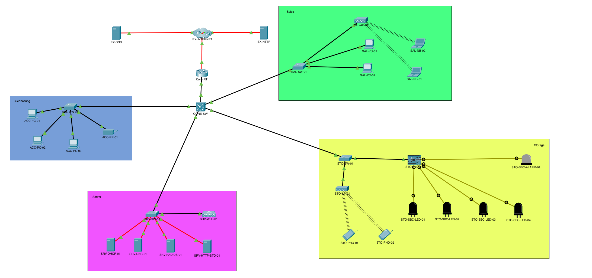

# Cisco Projekt

## Firmierung

### Candy Shop

Der **Candy Shop** ist ein innovatives kleines Unternehmen, das sich auf den Verkauf und die schnelle Lieferung von Süßwaren spezialisiert hat. Der Schwerpunkt liegt auf der Kombination klassischer Einzelhandelspraktiken mit modernen, digitalen Lösungen, um ein optimiertes Kundenerlebnis zu schaffen.

**Unternehmensgegenstand:**  
Der Candy Shop bietet ein breites Sortiment an Süßwaren an, die über eine eigens entwickelte Online-Plattform bestellt werden können. Durch ein integriertes IoT-System wird der Lagerbetrieb effizient gestaltet, und Bestellungen werden automatisiert an die zuständigen Abteilungen weitergeleitet.

**Unternehmensaufbau:**  
Das Unternehmen ist in drei Kernabteilungen gegliedert:  
- **Buchhaltung:** Verantwortlich für die Finanzverwaltung, Rechnungsstellung und Dokumentation.  
- **Sales:** Zuständig für den Kundenkontakt, die Pflege der Online-Plattform und den Vertrieb.  
- **Lager:** Verwalten der Bestände, Kommissionierung und Versand der Bestellungen.

**Unternehmensgröße:**  
Der Candy Shop beschäftigt insgesamt neun Mitarbeiter und betreibt einen zentralen Standort mit einer modularen Netzwerkstruktur, die auf zukünftige Expansion ausgelegt ist.

**Bezug zum Netz:**  
Das Unternehmen setzt ein integriertes Netzwerk ein, das verschiedene Abteilungen effizient verbindet. Dies umfasst sowohl kabelgebundene als auch drahtlose Verbindungen. Besonders hervorzuheben ist der Einsatz eines RADIUS-Servers für sichere WLAN-Authentifizierung und eines zentralen HTTP-Systems zur Steuerung des IoT-Netzwerks.

## Namenskonzept der Geräte

| Abteilung   | Namensschema         |
| ----------- | -------------------- |
| Lager       | `sto-<type>-<index>` |
| Sales       | `sal-<type>-<index>` |
| Buchhaltung | `acc-<type>-<index>` |
| Server      | `srv-<type>-<index>` |

### Netzwerke

- **Internes Netzwerk:** `10.207.0.0/16`
- **Externes/virtuelles Internet:** `172.29.107.0/24`

> Das externe Netzwerk wurde über mehrere Router-Hops hinweg durch OSPF statt statischem Routing erreichbar gemacht

## Passwörter

### Switch

| Name        | Passwort           | Modus     |
| ----------- | ------------------ | --------- |
| `core-sw`   | `7wj4VEvUeDS3Dj8H` | EXEC Mode |
| `core-sw`   | `wSg1OQ10gfgxBUcr` | Console   |
| `core-sw`   | `cfpjy3ofdv2I8rBs` | SSH       |
| `sal-sw-01` | `aZJpipWh49qzEFou` | EXEC Mode |
| `sal-sw-01` | `cz52cIHn3GU9o06e` | Console   |
| `sal-sw-01` | `SSLkMPnkkObYK7D2` | SSH       |
| `sto-sw-01` | `su9VsoAd99JaZ7Pk` | EXEC Mode |
| `sto-sw-01` | `EzKo1GCHwca5aIVx` | Console   |
| `sto-sw-01` | `v7b2djoI1e2od8Db` | SSH       |
| `srv-sw-01` | `F5jZCXeFeRDz20Bt` | EXEC Mode |
| `srv-sw-01` | `OHCfOBQsamH3HASi` | Console   |
| `srv-sw-01` | `6UW4LUKsPyfNlmG8` | SSH       |
| `acc-sw-01` | `yAyn0tdvFPFs9DD6` | EXEC Mode |
| `acc-sw-01` | `7j6Zg4t4YegeDn5K` | Console   |
| `acc-sw-01` | `1JsM1Je7zH9JvKiJ` | SSH       |

### Router

| Name      | Passwort           | Modus     |
| --------- | ------------------ | --------- |
| `core-rt` | `Dz83NJ048q0j6T5J` | EXEC Mode |
| `core-rt` | `M1C8HPMmGGFLAYot` | Console   |
| `core-rt` | `Il68ZJVGZf1P2Jvw` | SSH       |

> **Hinweis:** Der Benutzername für alle SSH-Zugriffe ist `admin`.

## VLAN

| Name        | Netzwerk       | VLAN-ID | Beschreibung      |
| ----------- | -------------- | ------- | ----------------- |
| Buchhaltung | 10.207.10.0/24 | 10      | Buchhaltung (ACC) |
| Server      | 10.207.20.0/24 | 20      | Server (SRV)      |
| Storage     | 10.207.30.0/24 | 30      | Lager (STO)       |
| Sales       | 10.207.40.0/24 | 40      | Vertrieb (SAL)    |
| Management  | 10.207.99.0/24 | 99      | Management        |

## Addressierungstabelle

| Name            | Interface | IP Address     | Subnet Mask / CIDR-Suffix | Default Gateway |
| --------------- | --------- | -------------- | ------------------------- | --------------- |
| Core-RT         | G/1/0     | 192.168.0.1/30 | 255.255.255.252           | N/A*            |
| Core-RT         | G/0/0     | 10.207.1.2/24  | 255.255.255.0             | N/A*            |
| Core-SW         | VLAN1     | 10.207.1.1     | 255.255.255.0             | 10.207.1.254    |
| Core-SW         | VLAN10    | 10.207.10.254  | 255.255.255.0             | 10.207.1.254    |
| Core-SW         | VLAN20    | 10.207.20.254  | 255.255.255.0             | 10.207.1.254    |
| Core-SW         | VLAN30    | 10.207.30.254  | 255.255.255.0             | 10.207.1.254    |
| Core-SW         | VLAN40    | 10.207.40.254  | 255.255.255.0             | 10.207.1.254    |
| Core-SW         | VLAN99    | 10.207.99.1    | 255.255.255.0             | 10.207.1.254    |
| ACC-SW-01       | VLAN99    | 10.207.99.2    | 255.255.255.0             | 10.207.10.254   |
| ACC-PC-01       | NIC       | DHCP           | 255.255.255.0             | 10.207.10.254   |
| ACC-PC-02       | NIC       | DHCP           | 255.255.255.0             | 10.207.10.254   |
| ACC-PC-03       | NIC       | DHCP           | 255.255.255.0             | 10.207.10.254   |
| ACC-PR-01       | NIC       | DHCP           | 255.255.255.0             | 10.207.10.254   |
| ACC-PC-01       | NIC       | SLAAC          | /64                       | FE80::1         |
| ACC-PC-02       | NIC       | SLAAC          | /64                       | FE80::1         |
| ACC-PC-03       | NIC       | SLAAC          | /64                       | FE80::1         |
| ACC-PR-01       | NIC       | SLAAC          | /64                       | FE80::1         |
| SRV-SW-01       | VLAN99    | 10.207.99.3    | 255.255.255.0             | 10.207.20.254   |
| SRV-DHCP-01     | NIC       | 10.207.20.1    | 255.255.255.0             | 10.207.10.254   |
| SRV-DNS-01      | NIC       | 10.207.20.2    | 255.255.255.0             | 10.207.20.254   |
| SRV-RADIUS-01   | NIC       | 10.207.20.3    | 255.255.255.0             | 10.207.20.254   |
| SRV-HTTP-STO-01 | NIC       | 10.207.20.4    | 255.255.255.0             | 10.207.20.254   |
| SRV-WLC-01      | NIC       | 10.207.20.5    | 255.255.255.0             | 10.207.20.254   |
| STO-SW-01       | VLAN99    | 10.207.99.4    | 255.255.255.0             | 10.207.30.254   |
| STO-AP-01       | G0        | DHCP           | 255.255.255.0             | 10.207.30.254   |
| STO-PHO-01      | WIRELESS0 | DHCP           | 255.255.255.0             | 10.207.30.254   |
| STO-PHO-02      | WIRELESS0 | DHCP           | 255.255.255.0             | 10.207.30.254   |
| STO-PHO-01      | WIRELESS0 | SLAAC          | /64                       | FE80::1         |
| STO-PHO-02      | WIRELESS0 | SLAAC          | /64                       | FE80::1         |
| STO-SBC-01      | G0        | 10.207.30.1    | 255.255.255.0             | 10.207.30.254   |
| SAL-SW-01       | VLAN99    | 10.207.99.5    | 255.255.255.0             | 10.207.40.254   |
| SAL-AP-01       | G0        | DHCP           | 255.255.255.0             | 10.207.40.254   |
| SAL-PC-01       | NIC       | DHCP           | 255.255.255.0             | 10.207.40.254   |
| SAL-PC-02       | NIC       | DHCP           | 255.255.255.0             | 10.207.40.254   |
| SAL-NB-01       | WIRELESS0 | DHCP           | 255.255.255.0             | 10.207.40.254   |
| SAL-NB-02       | WIRELESS0 | DHCP           | 255.255.255.0             | 10.207.40.254   |
| SAL-PC-01       | NIC       | SLAAC          | /64                       | FE80::1         |
| SAL-PC-02       | NIC       | SLAAC          | /64                       | FE80::1         |
| SAL-NB-01       | WIRELESS0 | SLAAC          | /64                       | FE80::1         |
| SAL-NB-02       | WIRELESS0 | SLAAC          | /64                       | FE80::1         |

> Obwohl es nicht als Pflichtaufgabe gefordert war, wurden die Geräte zusätzlich über IPv6 erreichbar gemacht

## Netztopologie

## Weitere Informationen

- Alle unnötigen Ports wurden entfernt und mit Abdeckungen versehen.
- Alle Switche wurden auf Glasfaser umgerüstet.
- Alle Geräte verfügen mindestens über ein Gigabit-Interface (soweit möglich).
- Die Konfiguration der WLC-APs wird nach einem Neustart nicht angezeigt, bleibt aber gespeichert (bekanntes Problem).
- Im Physical Mode wurden alle Geräte ordentlich geordnet und beschriftet.

## AP-Authentifizierung

In der ursprünglichen Aufgabe war PSK-Authentifizierung vorgesehen. Es wurde stattdessen ein **RADIUS-Server** aufgesetzt, um die Benutzer zentral zu verwalten. 

**Vorteile:**
- Erhöhte Sicherheit
- Einfache Verwaltung der Zugangsdaten

### Benutzer

| Benutzername | Passwort           |
| ------------ | ------------------ |
| lukas        | `gIAASa2ORTN8D9qz` |
| philipp      | `D8bLB6nhblKT0a21` |

## IoT / HTTP-Seite

Ein **IoT-System** wurde entwickelt, um den Kauf und Versand von Süßigkeiten zu vereinfachen.

> **Hinweis:** Der Cisco Packet Tracer benötigt bei komplexen HTTP-Seiten möglicherweise einige Sekunden zum Laden.

### Aus Kundensicht

1. Besuchen Sie die Website: `http://candy.shop` oder `http://www.candy.shop`
2. Klicken Sie auf "Jetzt Einkaufen".
3. Wählen Sie Süßigkeiten aus (einige Produkte können ausverkauft sein).
4. Die Daten sind zentral gespeichert und von jedem Gerät aus zugänglich.

### Aus Lagersicht

1. Besuchen Sie die Website: `http://storage.candy`
2. Bei einer Bestellung ertönt ein Alarm.
3. Mitarbeiter sehen die Bestellung und können die Süßigkeiten verpacken.
4. Beim Klick auf "Im Lager markieren" leuchtet eine LED am Lagerort des Produkts.
5. Nach dem Klick auf "Verpackt" erlischt die LED, und die Bestellung wird als "Versandt" markiert.

> **Hinweis:** Eine neue Bestellung aktiviert die LED des neuen Produkts und markiert die alte Bestellung automatisch als "Versandt".

### Code

- Der Code ist auf dem Gerät `STO-SBC-01` unter `iot.js` gespeichert.
- Die HTTP-Seite wurde in **Vite React TypeScript** entwickelt.

### GitHub
Das vollständige Projekt, einschließlich aller Codes und der Versionshistorie, kann auf GitHub eingesehen werden:

https://github.com/Tynopia/packettracer_01